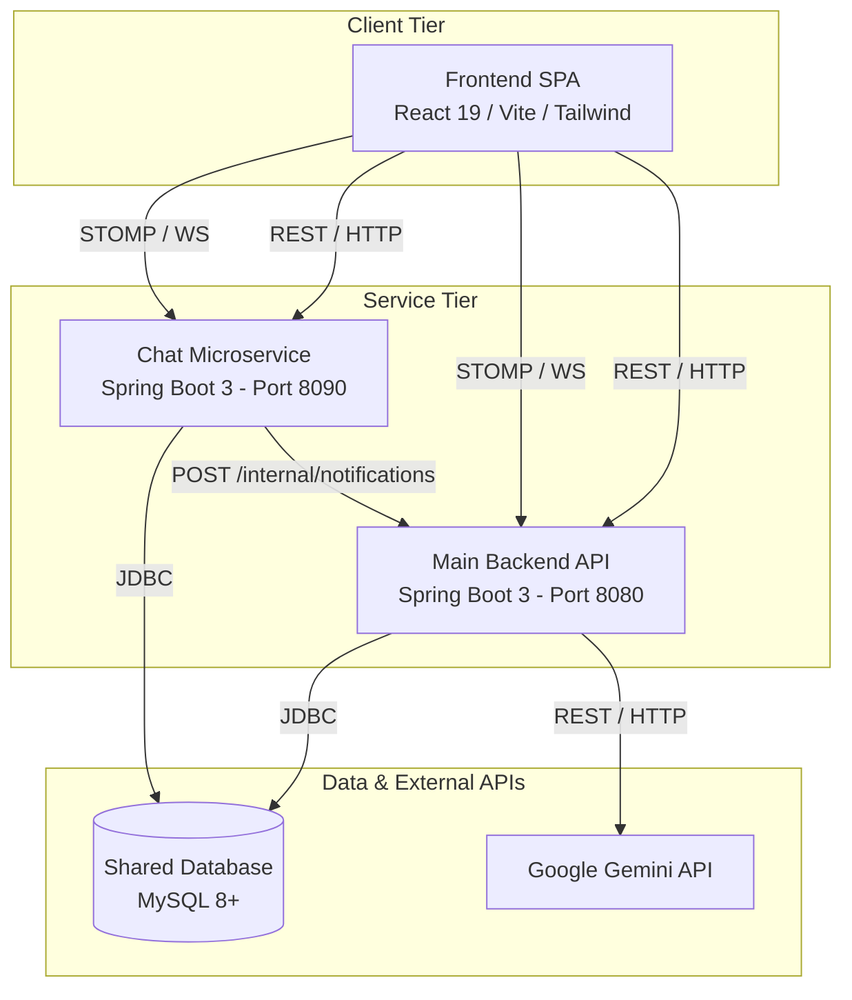
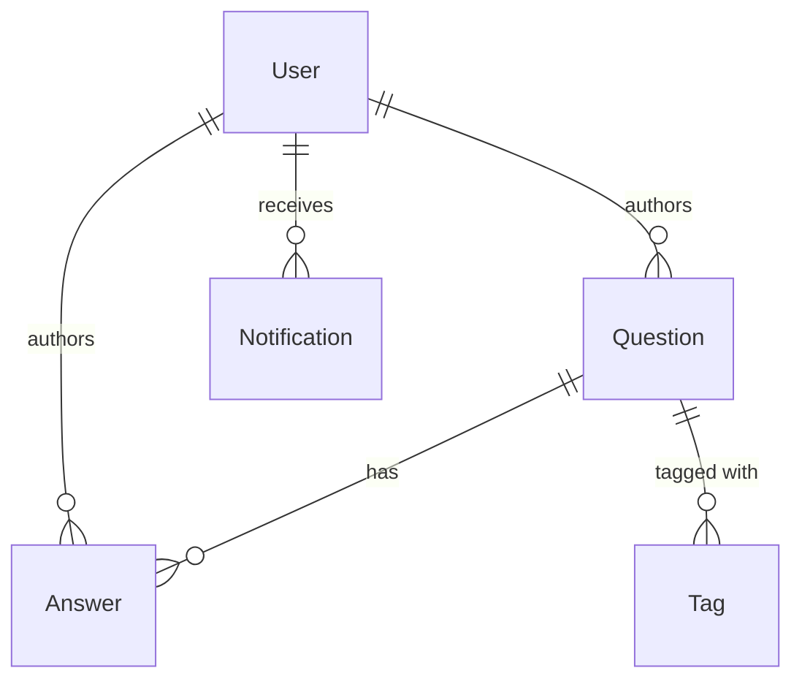
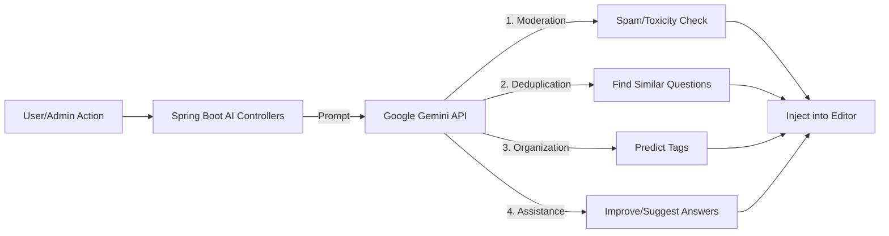
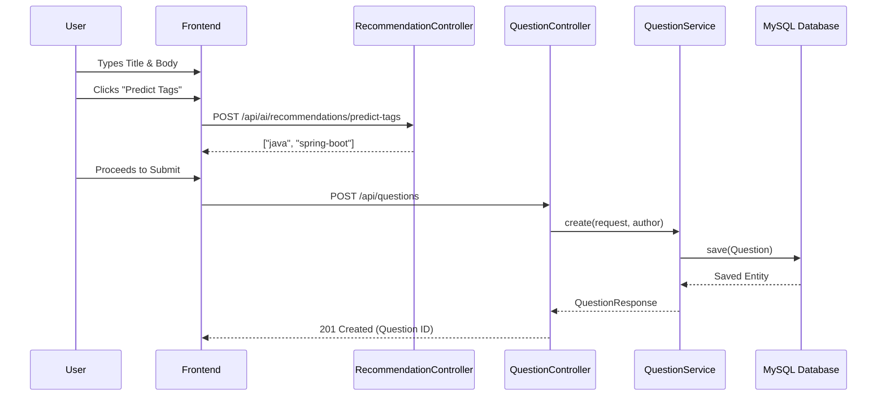

# DoConnect AI

<div align="center">
  <h3>A Premium, AI-Powered Developer Discussion Platform</h3>
  <p>Built with React, Spring Boot, WebSockets, and Google Gemini.</p>

  <p>
    
    
    
    
  </p>
</div>

---

## 1. Project Overview

DoConnect AI is a next-generation developer Q&A platform that embeds Large Language Models (LLMs) directly into the user workflow. Instead of treating AI as a separate chatbot, the platform uses Google's `gemini-2.0-flash` model as an invisible co-pilot to automate content moderation, detect duplicate questions semantically, auto-generate tags, and assist experts in drafting high-quality answers. 

By offloading high-throughput WebSocket chat traffic to an isolated microservice, DoConnect AI provides a scalable, enterprise-grade architecture that seamlessly blends real-time communication with deep AI integration.

---

## 2. Key Features

*   **Real-Time Ecosystem:** Instant in-app notifications and a global community chat powered by STOMP over WebSockets.
*   **Microservice Isolation:** Dedicated `chat-service` handles all WebSocket overhead, protecting the main REST API.
*   **Secure Inter-Service Communication:** Protected internal endpoints using cryptographically secure tokens.
*   **Advanced Q&A Workflows:** Question lifecycles, accepted answers, markdown support, and view tracking.
*   **Admin Dashboard:** Centralized view for platform analytics and content moderation queues.

---

## 3. AI Features

DoConnect AI deeply integrates the Gemini API to solve traditional forum problems:

*   **Semantic Duplicate Detection:** Prevents knowledge fragmentation by finding similar existing questions before a new one is submitted.
*   **Automated Tagging:** Analyzes question intent and automatically assigns relevant technical tags.
*   **Answer Drafting & Improvement:** Overcomes "writer's block" by generating suggested answers and refining user drafts (fixing grammar, tone, and formatting).
*   **Content Moderation:** Automatically flags toxic, spam, or off-topic content and quarantines it for admin review.
*   **Discussion Summarization:** Condenses long Q&A threads into brief summaries for faster reading.

---

## 4. Tech Stack

*   **Frontend:** React 19, Vite, Tailwind CSS 4, Axios, STOMP.js
*   **Backend (Main API):** Java 21, Spring Boot 3 (Web, Data JPA, Security), JWT, Google Gemini SDK
*   **Backend (Chat Service):** Java 21, Spring Boot 3 (WebSockets, STOMP), JWT
*   **Database:** MySQL 8+

---

## 5. System Architecture

The platform splits concerns between synchronous REST business logic and asynchronous real-time WebSocket communication.



---

## 6. High-Level Entity Relationship Diagram

A simplified look at the core logical entities driving the platform.



---

## 7. AI Workflow Diagram

How the Gemini API acts as an invisible co-pilot during the Q&A process.



---

## 8. Sequence Diagram: Ask Question

The core workflow when a user submits a new question, demonstrating AI involvement.



---

## 9. Screenshots

**Home Feed & Discovery**


**AI Draft Improvement**


**Global Chat & Notifications**


*(More screenshots available in `docs/screenshots/`)*

---

## 10. Installation Guide

### Prerequisites
*   Java 21
*   Node.js 20+
*   MySQL 8+

### Step 1: Database Setup
```sql
CREATE DATABASE doconnect_ai;
CREATE DATABASE doconnect_chat;
```

### Step 2: Start Main Backend
```bash
cd backend
./mvnw spring-boot:run
```

### Step 3: Start Chat Microservice
```bash
cd chat-service
./mvnw spring-boot:run
```

### Step 4: Start Frontend
```bash
cd frontend
npm install
npm run dev
```

The application will be accessible at `http://localhost:5173`.

---

## 11. Environment Variables

Create `.env` files in both backend directories based on their `.env.example`.

| Variable | Service | Description |
| :--- | :--- | :--- |
| `DB_URL` | Main & Chat | JDBC URL for MySQL (e.g., `jdbc:mysql://localhost:3306/doconnect_ai`) |
| `DB_USERNAME` | Main & Chat | MySQL Username |
| `DB_PASSWORD` | Main & Chat | MySQL Password |
| `JWT_SECRET` | Main & Chat | Minimum 32-character secret. **Must be identical across both services.** |
| `GEMINI_API_KEY` | Main | Your Google Gemini API Key for AI features. |
| `NOTIFICATION_INTERNAL_TOKEN` | Main & Chat | Shared secret for secure service-to-service communication. |

---

## 12. Documentation Links

For deeper technical dives, review our architecture documentation:

*   [Class Diagram](docs/diagrams/01-class-diagram.md)
*   [Database Relationships](docs/diagrams/02-database-relationships.md)
*   [Authentication Flow](docs/diagrams/03-authentication-flow.md)
*   [Question & Answer Lifecycles](docs/diagrams/04-question-lifecycle.md)
*   [WebSocket Communication](docs/diagrams/06-websocket-communication.md)
*   [Deployment Architecture](docs/diagrams/08-deployment-architecture.md)

---

## 13. Future Improvements

1.  **Email Integration:** Offline notifications for accepted answers.
2.  **Advanced Search:** Elasticsearch integration for full-text search.
3.  **Private Messaging:** User-to-user DMs via the chat service.
4.  **Reputation System:** Gamified points for high-quality contributions.
5.  **Dockerization:** Unified `docker-compose.yml` for instant deployment.

---
*Developed by Mithun Raj M R.*
