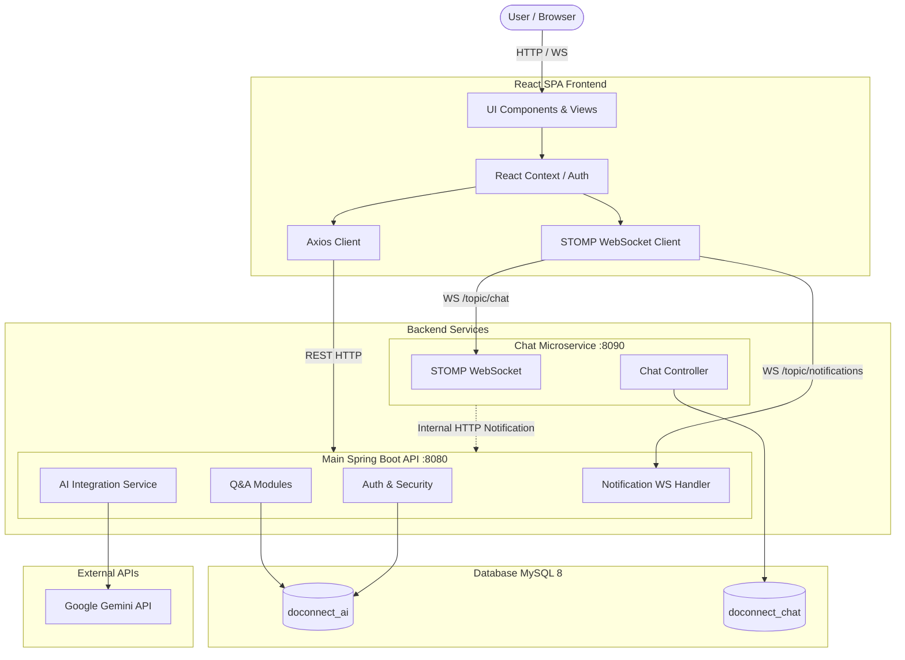

# High-Level Design (HLD) - DoConnect AI

## 1. Introduction
### 1.1 Purpose
This document provides the High-Level Design for the **DoConnect AI** capstone project. It outlines the system architecture, primary components, technology stack, and overarching data flows. DoConnect AI is an AI-powered collaborative discussion and knowledge platform, akin to a lightweight Stack Overflow combined with a real-time chat room and AI-assisted answering capabilities.

### 1.2 Scope
This document covers:
* System Architecture & Topology
* Major Components & Modules
* High-Level Data Flow and Interactions
* Security and Authentication Architecture

## 2. System Architecture
The application follows a modern monolithic multi-service architecture (comprising a core monolithic API, a separate chat microservice, and a decoupled SPA frontend) backed by a relational database and third-party AI services.

### 2.1 Architecture Diagram

## 3. High-Level Components

### 3.1 Frontend Application
* **Framework:** React 19 built with Vite.
* **Routing:** React Router 7 for client-side routing (Pages: Feed, Ask, Profile, Login, etc.).
* **State Management:** React Context API for global state (e.g., AuthProvider for user sessions).
* **Communication:** Axios for REST API calls and `@stomp/stompjs` for real-time WebSocket communication.
* **Styling:** Tailwind CSS 4 with Lucide React icons.

### 3.2 Main Backend API
* **Framework:** Java 21 / Spring Boot 3.5.x.
* **Architecture Style:** Monolithic layered architecture (Controller, Service, Repository).
* **Modules:** 
  * **Auth:** JWT-based user registration, login, and authorization.
  * **Q&A Content:** Question and Answer CRUD operations, Tagging system.
  * **AI Assistance:** Wrappers for calling Google Gemini for answer suggestions, draft improvements, and tag predictions.
  * **Notifications:** Internal push-notification mechanisms.

### 3.3 Chat Microservice
* **Framework:** Java 21 / Spring Boot 3.5.x.
* **Purpose:** Handles all real-time STOMP/WebSocket chat traffic to avoid overloading the main REST API.
* **Authentication:** Validates JWTs generated by the Main API using a shared secret.
* **Integration:** Sends internal HTTP events to the Main API when chat notifications need to be pushed globally.

### 3.4 Database
* **Engine:** MySQL 8.0.
* **Schemas:** Separated into `doconnect_ai` for core entities (users, questions, answers, tags) and `doconnect_chat` for real-time messages. This decouples the heavy write-load of chat logs from the core content schema.

### 3.5 External AI Engine
* **Service:** Google Gemini API (via HTTP/JSON).
* **Usage:** Used on-demand when users click "Suggest Answer", "Summarise", or while typing for automatic tag prediction.

## 4. High-Level Data Flow

### 4.1 Authentication Flow
1. User submits login credentials to `/api/auth/login`.
2. Main API validates against BCrypt hash in `doconnect_ai`.
3. Main API generates an HS256 JWT and returns it.
4. Frontend stores the JWT in `localStorage` and attaches it as a `Bearer` token to all subsequent Axios requests.

### 4.2 Q&A Post and View Flow
1. **Creation:** User submits a new question. API validates the JWT, processes tags, and persists to MySQL.
2. **Retrieval:** User accesses the Feed. Frontend calls `/api/questions`. API queries the database with pagination, applies filters, and returns JSON.
3. **AI Enhancement:** The backend may trigger an asynchronous background task or an immediate call to Gemini to generate automatic tags or moderation flags.

### 4.3 Real-Time Chat Flow
1. User connects to the Chat Microservice via WebSocket (`/ws`).
2. The Chat Service validates the JWT during the STOMP `CONNECT` frame.
3. User subscribes to `/topic/global` or `/topic/questions/{id}`.
4. User sends a message. The Chat Service persists it to `doconnect_chat` and broadcasts it to subscribers.

## 5. Security Architecture
* **Stateless Sessions:** No server-side HTTP sessions. Everything relies on signed JWTs.
* **Cross-Origin Resource Sharing (CORS):** In development, handled via Vite's proxy. In production, explicit allowed origins are configured in Spring properties.
* **Internal Service Communication:** The Chat Microservice communicates with the Main API via an internal token (`X-Internal-Token`) to prevent public endpoints from triggering internal notification logic.
* **Passwords:** Hashed using BCrypt before persistence.
* **Role-Based Access Control (RBAC):** Users are assigned roles (`USER`, `MODERATOR`, `ADMIN`). Sensitive endpoints (like deleting someone else's question or viewing global analytics) enforce role checks via Spring Security.
