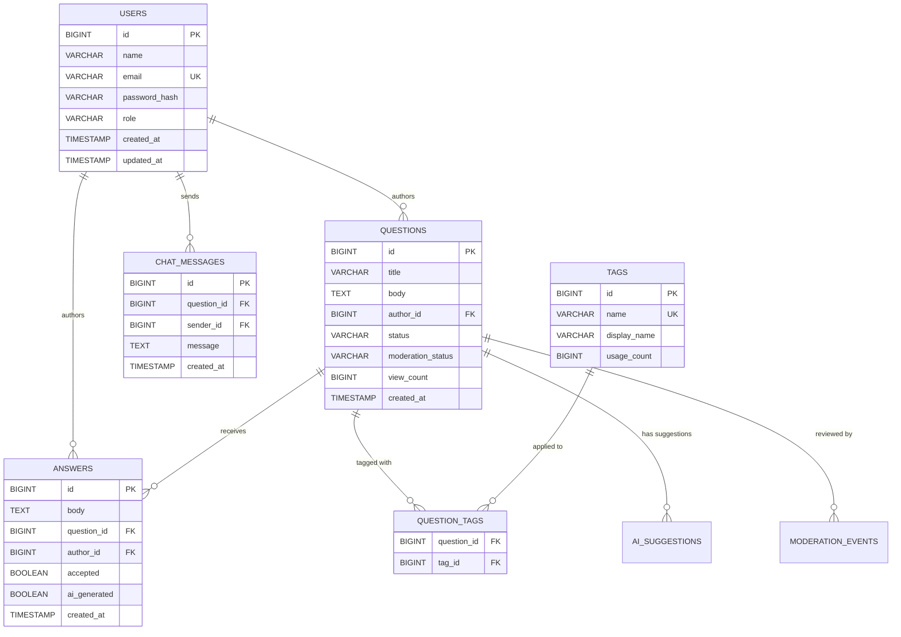

# Low-Level Design (LLD) - DoConnect AI

## 1. Introduction
This document details the Low-Level Design (LLD) of the **DoConnect AI** platform. It defines the database schema, class-level software design for the backend, frontend component hierarchy, and the exact data models used for communication between modules.

## 2. Database Schema Design
The data layer relies on MySQL 8 with JPA/Hibernate managing table generation (`update` mode in dev).

### 2.1 Entity Relationship Diagram



## 3. Backend Component Design (Spring Boot)

### 3.1 Layered Architecture Pattern
Each functional domain (Auth, Question, Answer, Tag) implements a strictly layered pattern:
1. **Controller Layer:** `@RestController`. Maps HTTP requests, validates DTOs via `@Valid`, and returns `ResponseEntity`.
2. **Service Layer:** `@Service`. Contains business logic, ownership validation, handles transactional boundaries (`@Transactional`), and maps entities to response DTOs.
3. **Repository Layer:** Interfaces extending `JpaRepository` for CRUD and custom query generation.

### 3.2 Security Component Detail
* **`JwtService`:** Responsible for generating and verifying HS256 signed JWTs. Extracts `Claims` (like user ID and role).
* **`JwtAuthenticationFilter`:** Extends `OncePerRequestFilter`. Intercepts incoming requests, extracts the Bearer token, calls `JwtService`, and populates the `SecurityContextHolder` with `AppUserDetails`.
* **`ApiExceptionHandler`:** Annotated with `@RestControllerAdvice`. Catches exceptions like `ResourceNotFoundException`, `MethodArgumentNotValidException`, and `AccessDeniedException` to return a standardized `ApiError` JSON response.

### 3.3 AI Service Logic
* **`AiService`:** A wrapper around the Google Gemini REST API.
* Constructs prompts based on the action. E.g., for answer generation:
  * *Prompt Template:* "You are an expert developer. Provide a clear, concise, and accurate answer to the following question: {title} - {body}. Format as markdown."
* Handles HTTP timeouts and generic fallback responses if the Gemini API is rate-limited or fails.

## 4. Frontend Component Design (React + Vite)

### 4.1 Folder Structure Detail
```text
frontend/src/
  ├── components/
  │   ├── NavBar.jsx         # Top navigation and user menu
  │   ├── ProtectedRoute.jsx # Route wrapper ensuring Auth state
  │   ├── QuestionCard.jsx   # UI for question list items
  │   └── TagBadge.jsx       # Reusable tag UI
  ├── context/
  │   ├── AuthContext.jsx    # React Context holding user info & JWT
  │   └── NotifyContext.jsx  # WebSocket notification listener state
  ├── hooks/
  │   └── useChat.js         # Custom hook managing STOMP connection logic
  ├── lib/
  │   └── axios.js           # Axios instance with Authorization interceptor
  └── pages/
      ├── FeedPage.jsx       # Main list of questions
      ├── AskPage.jsx        # Form for new questions with AI Tag Predictor
      └── QuestionDetailPage.jsx # Views question, answers, and live chat
```

### 4.2 State Flow Example: Ask a Question
1. User types in `AskPage.jsx`.
2. `onChange` event debounces input and calls AI Tag Prediction endpoint via `axios.js`.
3. Suggested tags appear; user selects them.
4. `onSubmit` fires. `axios.post('/api/questions', formData)` is executed.
5. On `201 Created`, React Router navigates to `/questions/{newId}`.

## 5. API Specification Summary

### 5.1 Content Modules
* `POST /api/questions`: Create a question. Requires `QuestionRequest` DTO (title, body, tags). Returns `QuestionResponse`.
* `GET /api/questions`: Get paginated feed. Query params: `page`, `size`, `tag`.
* `GET /api/questions/{id}`: Fetch question, its tags, and its associated answers.
* `POST /api/questions/{id}/answers`: Submit an answer.
* `POST /api/questions/{id}/accept/{answerId}`: Mark an answer as accepted (Owner only).

### 5.2 AI & Tools
* `POST /api/ai/questions/{id}/suggest-answer`: Triggers Gemini API; returns a drafted `AnswerResponse` object with `ai_generated=true`.
* `GET /api/ai/recommendations/similar/{id}`: Returns a list of `QuestionResponse` objects that share tags or semantic similarity.

## 6. Real-time Chat Implementation
* **Library:** `@stomp/stompjs` on the frontend, `spring-boot-starter-websocket` on the backend.
* **Connection:** Frontend connects to `ws://localhost:8090/ws`.
* **Subscription:** Frontend subscribes to `/topic/questions/{id}`.
* **Publishing:** Frontend sends JSON message to `/app/questions/{id}/chat`.
* **Broker:** Backend uses the SimpleBroker. Redis or RabbitMQ is recommended for production scaling but omitted for the capstone scope.
