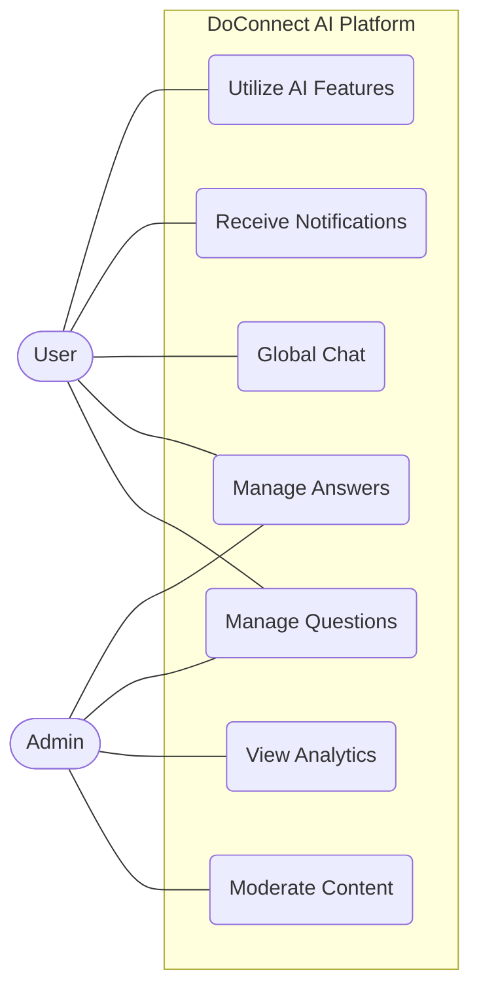

# System Use Case Diagram

### Explanation
This diagram shows the high-level boundary of the DoConnect AI system and the primary actors interacting with it. It captures the holistic scope of the application.

### Source Code References
- **Actors**: Derived from `UserRole.java` (`USER`, `ADMIN`).
- **Use Cases**: Derived from `QuestionController.java`, `AnswerController.java`, `ChatController.java` (chat-service), `AiController.java`, and `NotificationController.java`.

```mermaid
usecaseDiagram
  actor User
  actor Admin
  
  package "DoConnect AI Platform" {
    usecase "Manage Questions" as UQ
    usecase "Manage Answers" as UA
    usecase "Global Chat" as UC
    usecase "Receive Notifications" as UN
    usecase "Utilize AI Features" as UAI
    usecase "Moderate Content" as UM
    usecase "View Analytics" as UAN
  }
  
  User --> UQ
  User --> UA
  User --> UC
  User --> UN
  User --> UAI
  
  Admin --> UM
  Admin --> UAN
  Admin --> UQ
  Admin --> UA
```
*(Note: Mermaid syntax for use cases natively is limited, so using standard graph syntax to represent use cases is often required. The above uses a conceptual pseudo-usecase representation. A standard mermaid graph representation is below for rendering support).*


