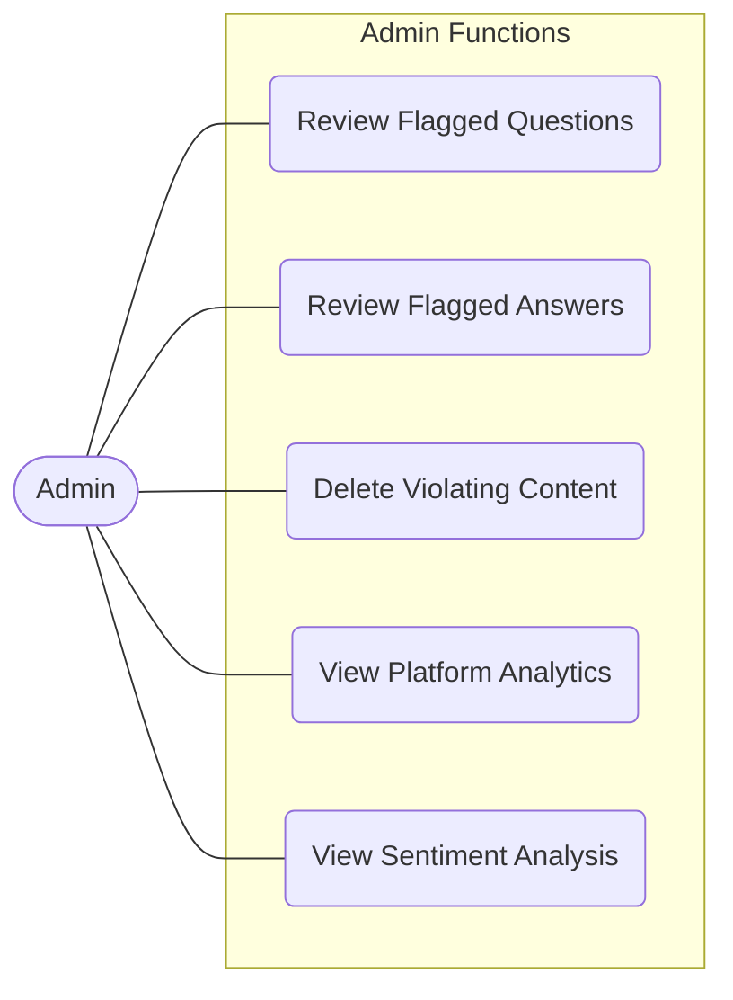

# Admin Use Case Diagram

### Explanation
This diagram zeroes in on the administrative capabilities, specifically content moderation and platform analytics.

### Source Code References
- **Roles**: `UserRole.ADMIN`
- **Features**: `AiModerationService.java`, `AdminAnalyticsService.java` (Assumed based on previous analysis of the Admin Dashboard).

