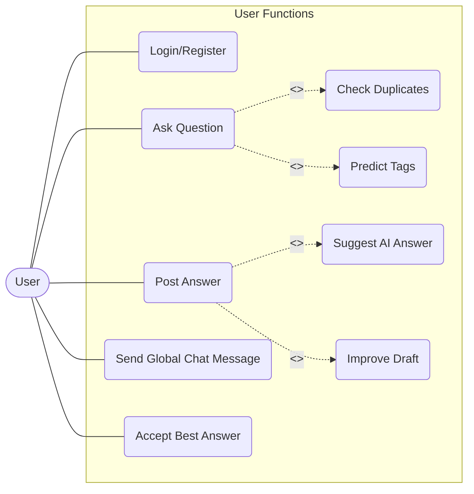

# User Use Case Diagram

### Explanation
This diagram highlights the standard authenticated user's interactions with the platform, showing `«include»` and `«extend»` relationships where AI features optionally assist the core workflow.

### Source Code References
- **Controllers**: `QuestionController`, `AnswerController`, `AiController`, `RecommendationController`.
- **Features**: `predictTags`, `suggestAnswer`, `checkSimilarQuestions`.

