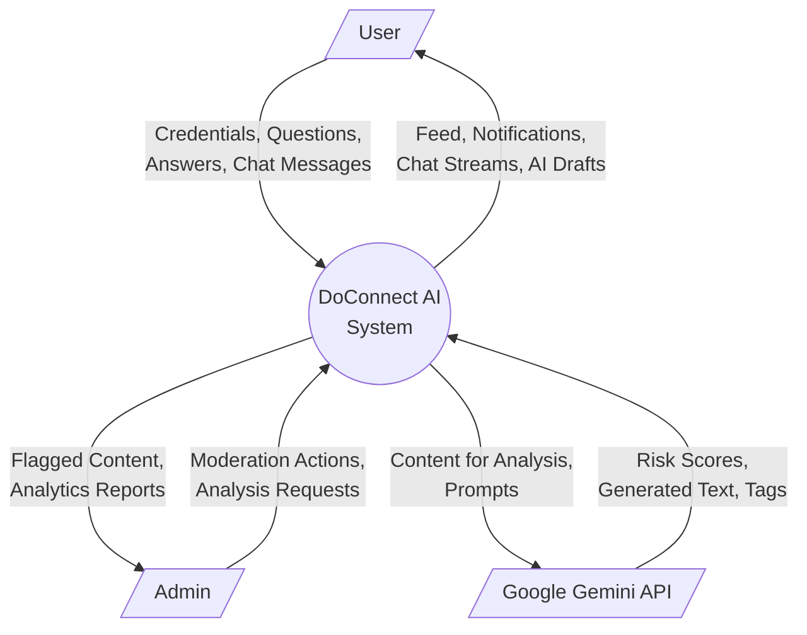

# DFD Level 0 (Context Diagram)

### Explanation
This diagram shows the highest level view of the DoConnect AI system, representing it as a single process interacting with external entities (User, Admin, Google Gemini API).

### Source Code References
- **System**: `DoConnect AI System` (Backend + Frontend + Chat)
- **External Entities**: `Google Gemini API` (called via `GeminiService.java`).

