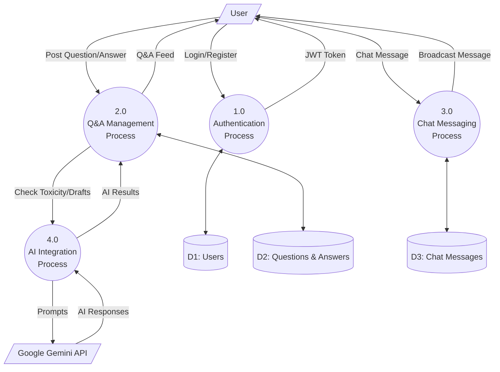

# DFD Level 1

### Explanation
This diagram breaks down the main system into its primary sub-processes (Auth, Q&A Management, Chat, AI Integration) and shows the data stores.

### Source Code References
- **Processes**: Mapped to `AuthController`, `QuestionController`/`AnswerController`, `ChatController`, `AiController`.
- **Data Stores**: `users`, `questions`, `answers`, `chat_messages` tables.

