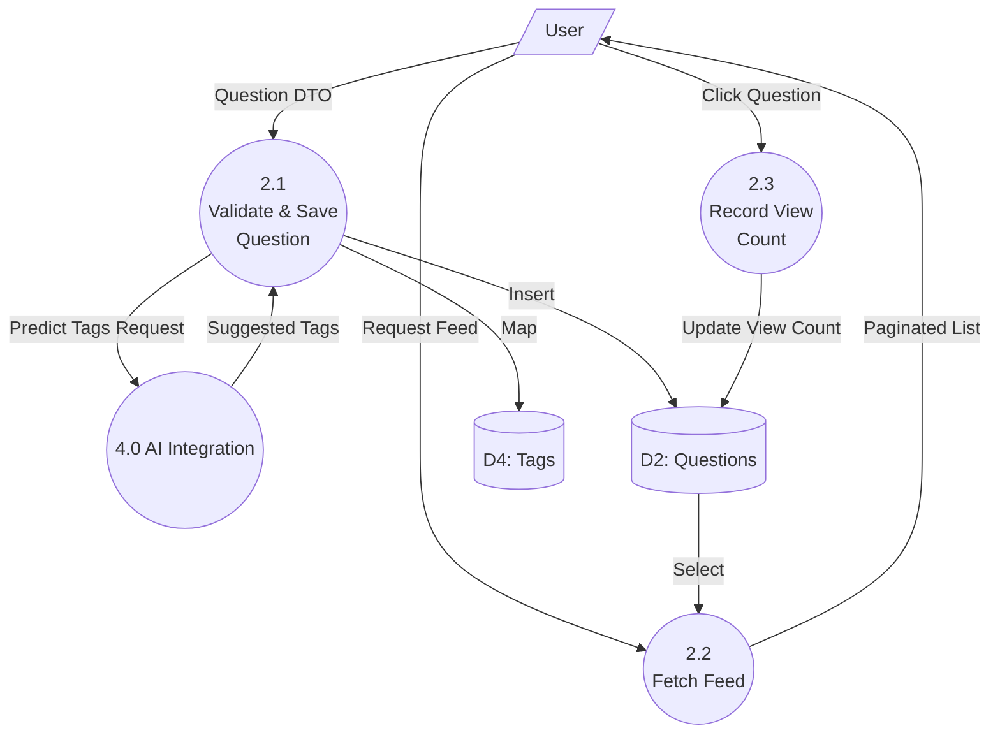

# DFD Level 2 (Question Management)

### Explanation
This diagram explodes the "2.0 Q&A Management" process from Level 1 to show the specific data flows inside question creation and viewing.

### Source Code References
- **Processes**: `QuestionController.create()`, `QuestionController.findAll()`, `QuestionService.recordView()`.

