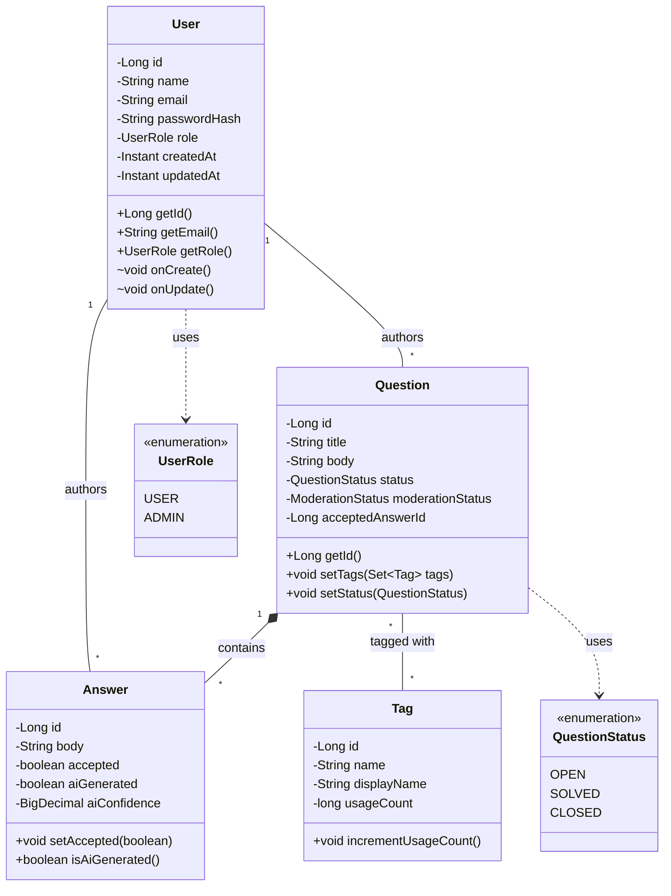

# Enhanced Class Diagram

### Explanation
This is a strict UML class diagram showing attributes, methods, visibility modifiers, and relationships for the core entity layer.

### Source Code References
- Entity classes in `com.doconnect.backend.*`

