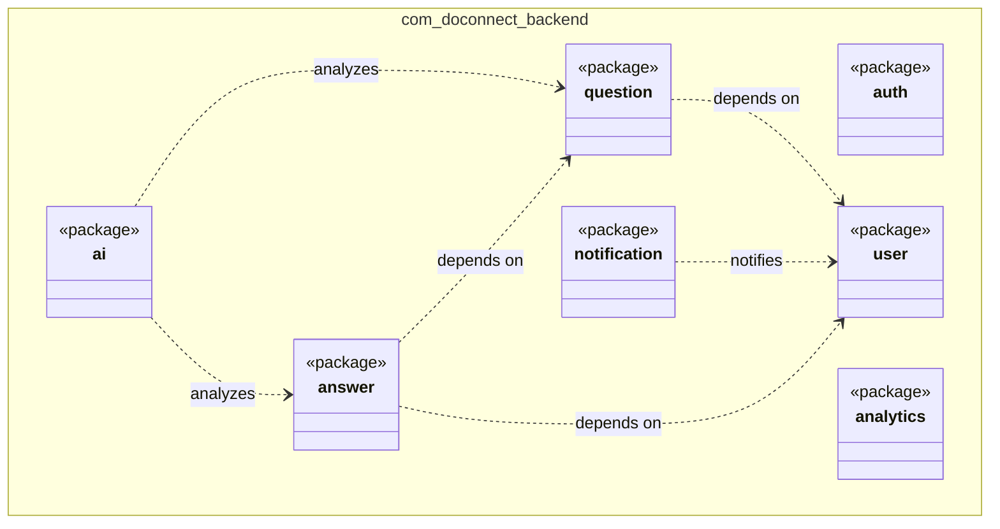

# Package Diagram

### Explanation
This UML package diagram illustrates the modular structure of the Spring Boot backend, showing how domains are segregated.

### Source Code References
- Directory structure of `backend/src/main/java/com/doconnect/backend`.

