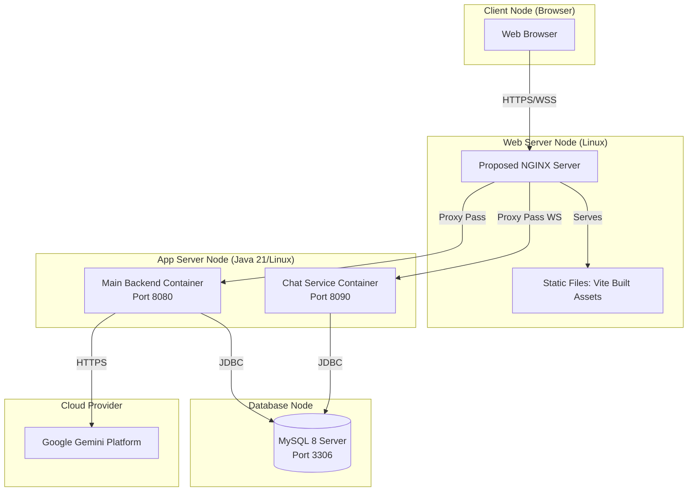

# Deployment Diagram

### Explanation
This UML Deployment Diagram maps software components to physical or virtual hardware nodes, typical for the projected production environment.

### Source Code References
- Presumed from standard Spring Boot + Vite + MySQL multi-service stacks (No explicit docker-compose exists in the codebase). This diagram represents the **Proposed Production Deployment Architecture**, differentiating the logical services from the recommended proxy.

