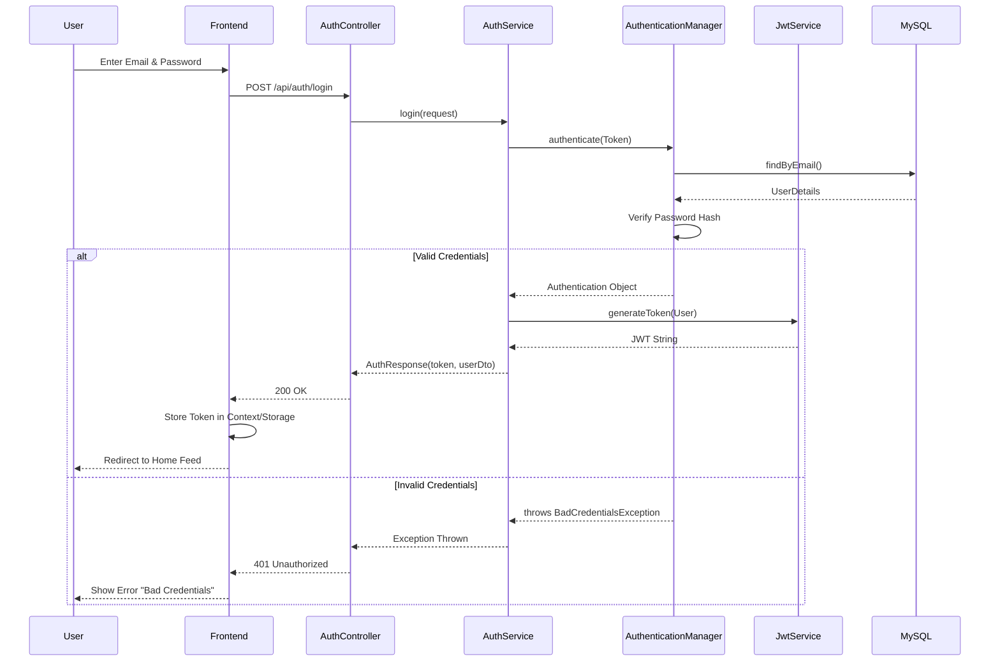

# Sequence Diagram: Login

### Explanation
This sequence diagram shows the strict flow of a user authenticating and receiving a JWT.

### Source Code References
- `AuthController.java` (`@PostMapping("/login")`), `AuthService.java`, `JwtService.java`.

