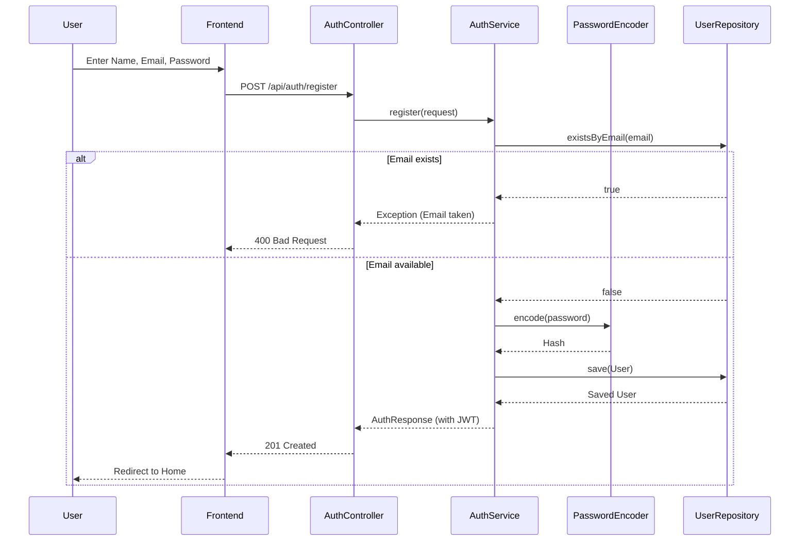

# Sequence Diagram: Register

### Explanation
This sequence diagram maps the user registration flow, including validation.

### Source Code References
- `AuthController.java` (`@PostMapping("/register")`), `AuthService.java`.

