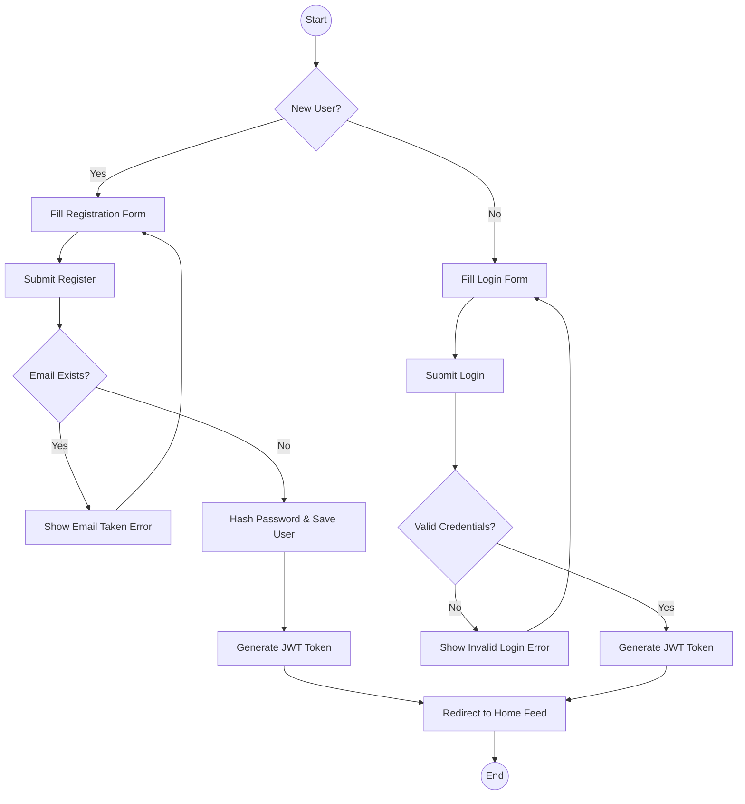

# Activity Diagram: User Authentication

### Explanation
This flowchart details the sequence of activities and decision points during user login and registration.

### Source Code References
- `AuthController.java`, `AuthService.java`

