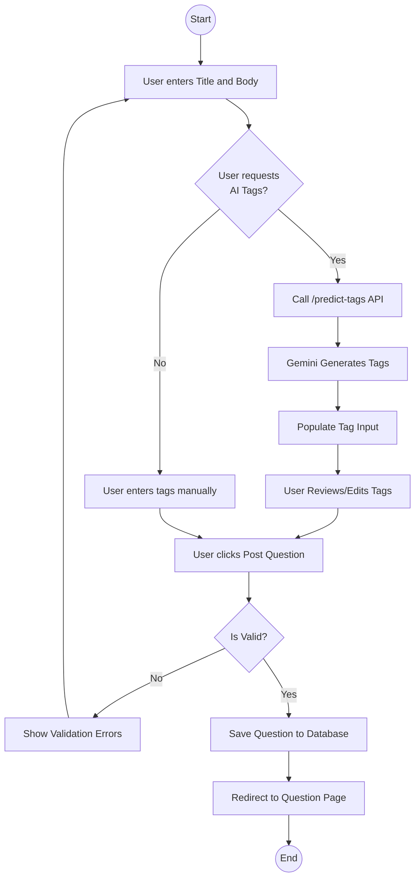

# Activity Diagram: Ask Question

### Explanation
This activity diagram tracks the user and system activities when asking a new technical question, including optional AI assistance paths.

### Source Code References
- `QuestionController.create()`, `RecommendationController.predictTags()`, `AskPage.jsx`.

