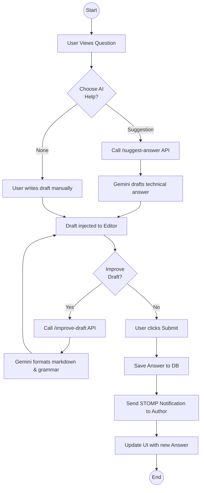

# Activity Diagram: Answer Question

### Explanation
This activity diagram maps the process of a user drafting an answer, including the "Improve Draft" and "Generate Suggestion" AI paths.

### Source Code References
- `AnswerController.create()`, `AiController.improveDraft()`, `AiController.suggestAnswer()`.

