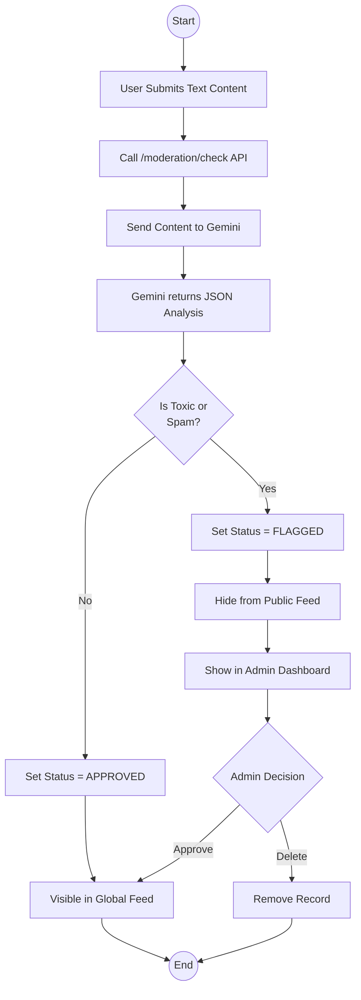

# Activity Diagram: AI Moderation

### Explanation
This diagram shows how content is checked for toxicity and spam before being fully visible or immediately flagged.

### Source Code References
- `AiController.checkModeration()`, `AiModerationService.java`

