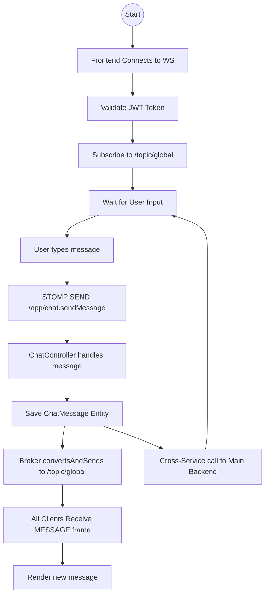

# Activity Diagram: Chat Flow

### Explanation
This diagram illustrates the event loop for a user sending and receiving global chat messages.

### Source Code References
- `ChatController.sendMessage()`, `NotificationClient.java`

