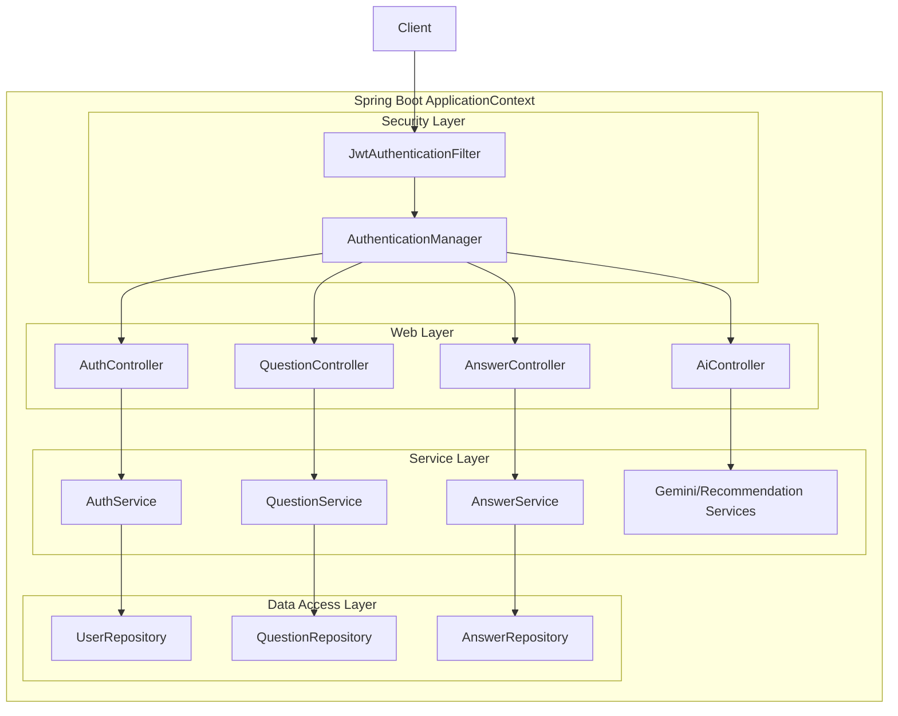

# Backend Architecture Diagram

### Explanation
This component diagram focuses exclusively on the inner structure of the `backend` Spring Boot application.

### Source Code References
- Packages: `com.doconnect.backend.auth`, `question`, `answer`, `ai`, `notification`.

