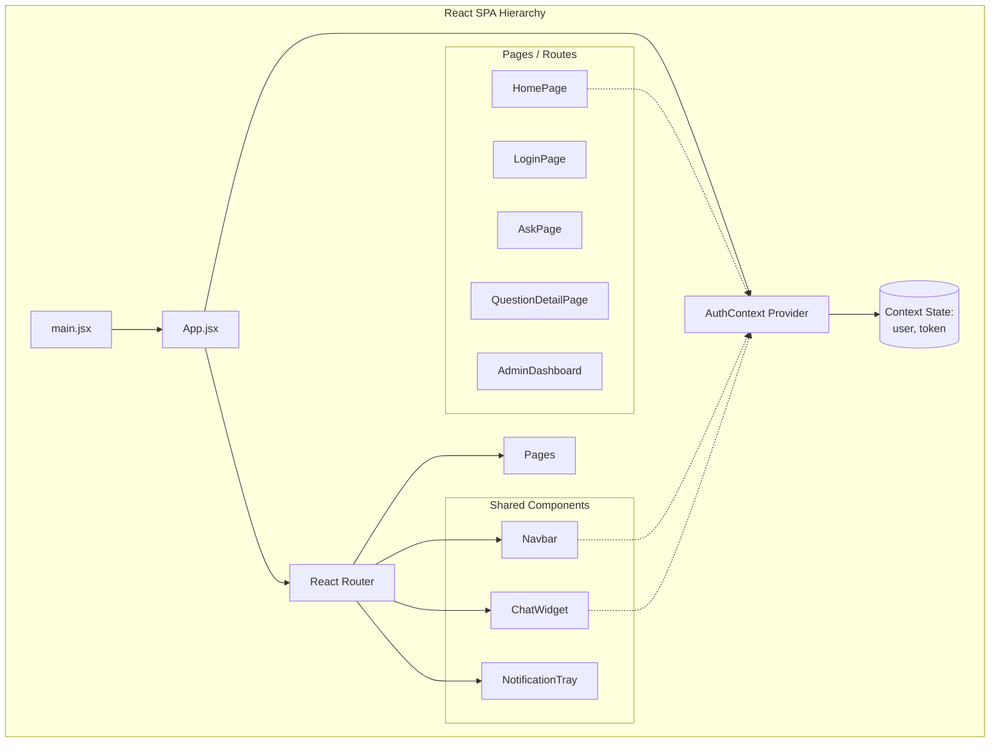

# Frontend Architecture Diagram

### Explanation
This diagram outlines the component hierarchy and state management flow within the React SPA.

### Source Code References
- React components in `frontend/src/` (e.g., `App.jsx`, `AuthContext.jsx`, `pages/`, `components/`).

