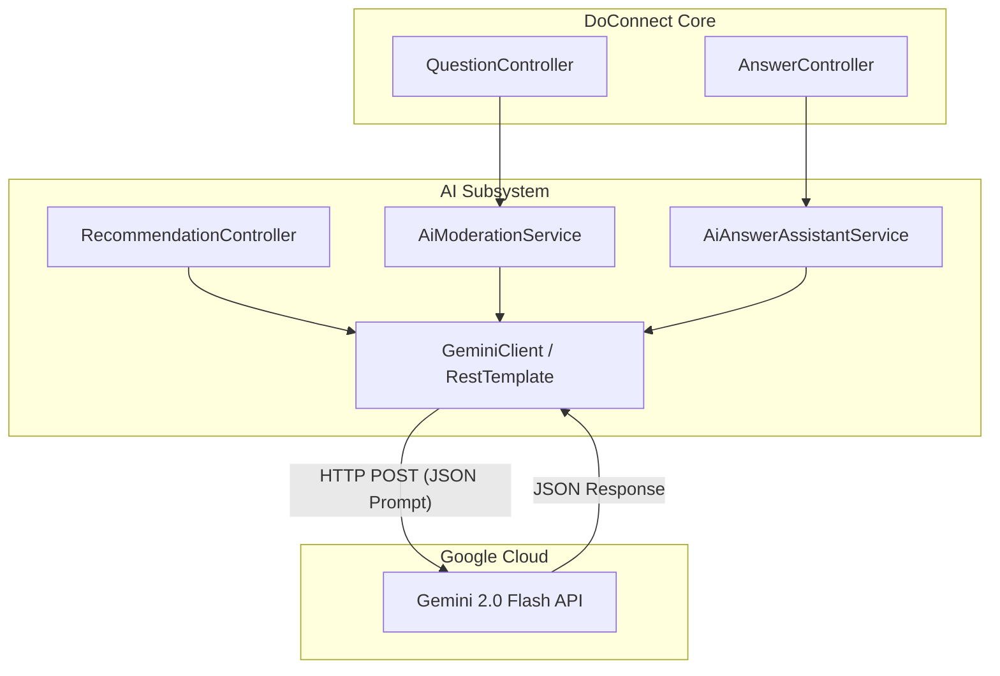

# AI Integration Architecture Diagram

### Explanation
Details the integration layer between the Spring Boot application and the Google Gemini API.

### Source Code References
- `GeminiService.java`, `AiModerationService.java`, `AiAnswerAssistantService.java`.

