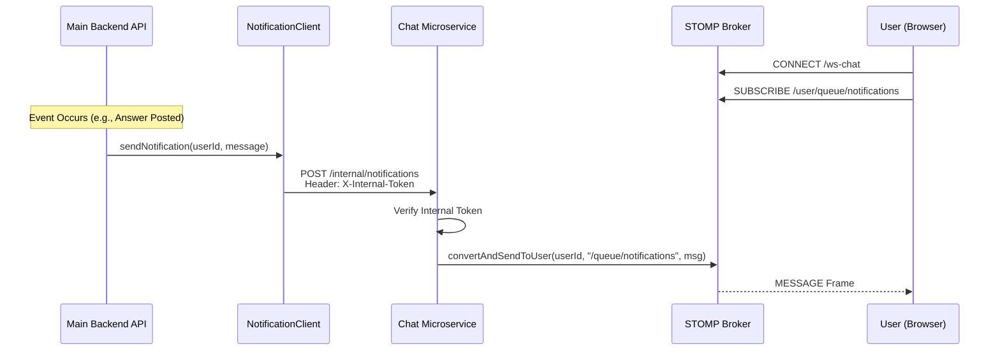

# Sequence Diagram: Notification Delivery

### Explanation
Illustrates the inter-service communication required to deliver a real-time notification when an event occurs in the main backend.

### Source Code References
- `NotificationClient.java` (Main), `InternalNotificationController.java` (Chat).

