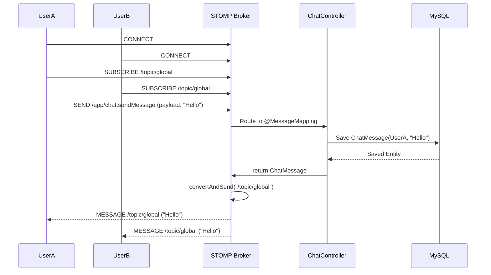

# Sequence Diagram: Chat Message

### Explanation
Details the exact STOMP frame sequence when sending a chat message.

### Source Code References
- `ChatController.java` (`@MessageMapping("/chat.sendMessage")`).

