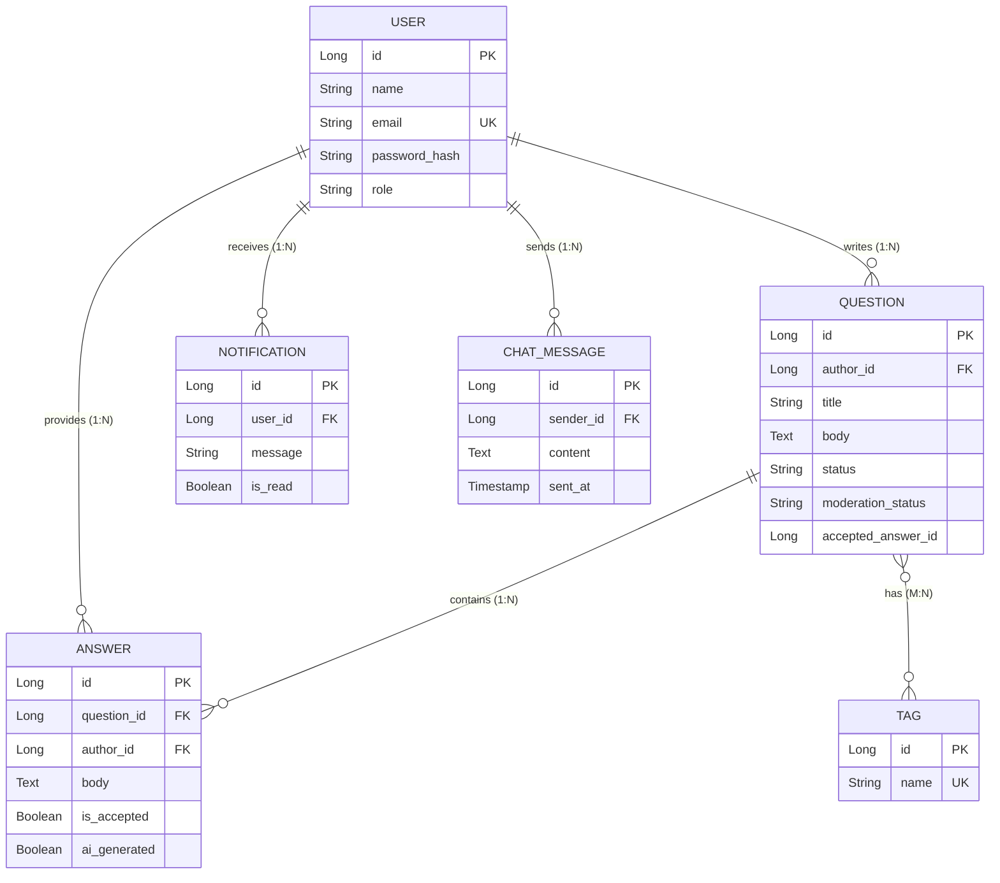

# Enhanced ER Diagram

### Explanation
An Enhanced Entity-Relationship (EER) diagram detailing entities, attributes, and precise cardinalities.

### Source Code References
- `@Entity` classes (`User`, `Question`, `Answer`, `Tag`, `Notification`, `ChatMessage`).

