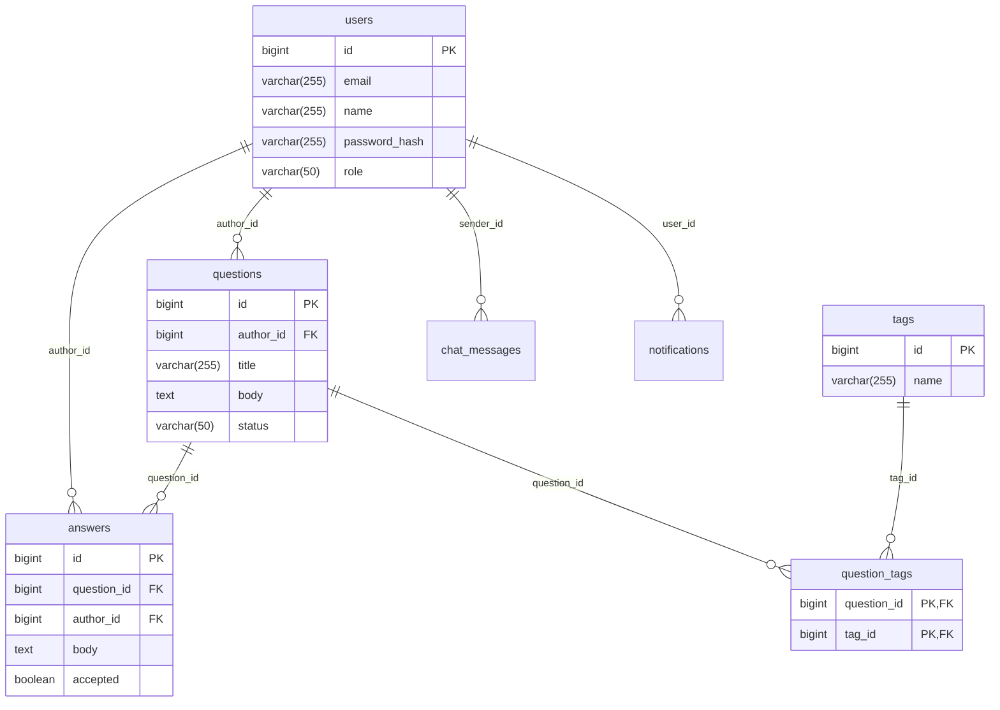

# Physical Database Schema

### Explanation
Represents the actual generated SQL schema structures based on Hibernate/JPA generation.

### Source Code References
- JPA annotations like `@JoinTable(name="question_tags")`.

