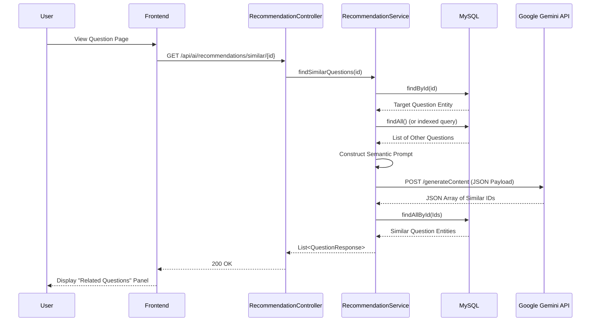

# Sequence Diagram: AI Similar Question Detection

### Explanation
This sequence diagram illustrates the workflow of the system querying the backend to find semantically similar questions using the Gemini API.

### Source Code References
- `RecommendationController.java` (`@GetMapping("/similar/{questionId}")`)
- `RecommendationService.java` (`findSimilarQuestions`)
- `GeminiClient.java`

