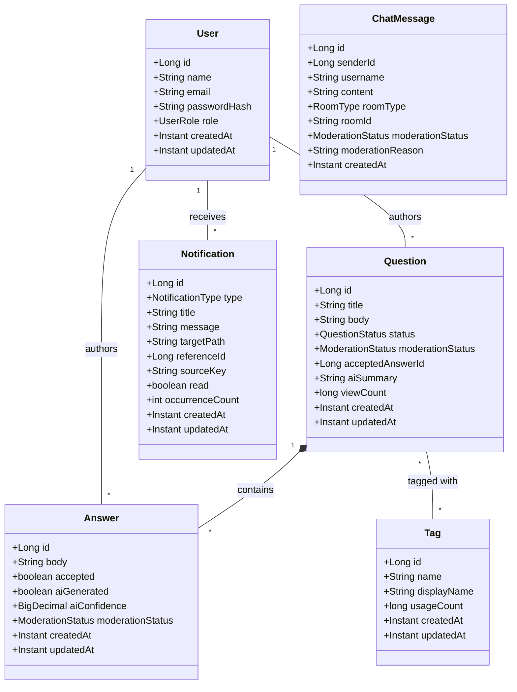

# Class Diagram

This diagram represents the core domain models in the DoConnect AI platform, derived from the actual `@Entity` classes in the backend and chat-service.

```mermaid
classDiagram
    class User {
        +Long id
        +String name
        +String email
        +String passwordHash
        +UserRole role
        +Instant createdAt
        +Instant updatedAt
    }

    class Question {
        +Long id
        +String title
        +String body
        +QuestionStatus status
        +ModerationStatus moderationStatus
        +Long acceptedAnswerId
        +String aiSummary
        +long viewCount
        +Instant createdAt
        +Instant updatedAt
    }

    class Answer {
        +Long id
        +String body
        +boolean accepted
        +boolean aiGenerated
        +BigDecimal aiConfidence
        +ModerationStatus moderationStatus
        +Instant createdAt
        +Instant updatedAt
    }

    class Tag {
        +Long id
        +String name
        +String displayName
        +long usageCount
        +Instant createdAt
        +Instant updatedAt
    }

    class Notification {
        +Long id
        +NotificationType type
        +String title
        +String message
        +String targetPath
        +Long referenceId
        +String sourceKey
        +boolean read
        +int occurrenceCount
        +Instant createdAt
        +Instant updatedAt
    }

    class ChatMessage {
        +Long id
        +Long senderId
        +String username
        +String content
        +RoomType roomType
        +String roomId
        +ModerationStatus moderationStatus
        +String moderationReason
        +Instant createdAt
    }

    User "1" -- "*" Question : authors
    User "1" -- "*" Answer : authors
    User "1" -- "*" Notification : receives
    Question "1" *-- "*" Answer : contains
    Question "*" -- "*" Tag : tagged with
```
