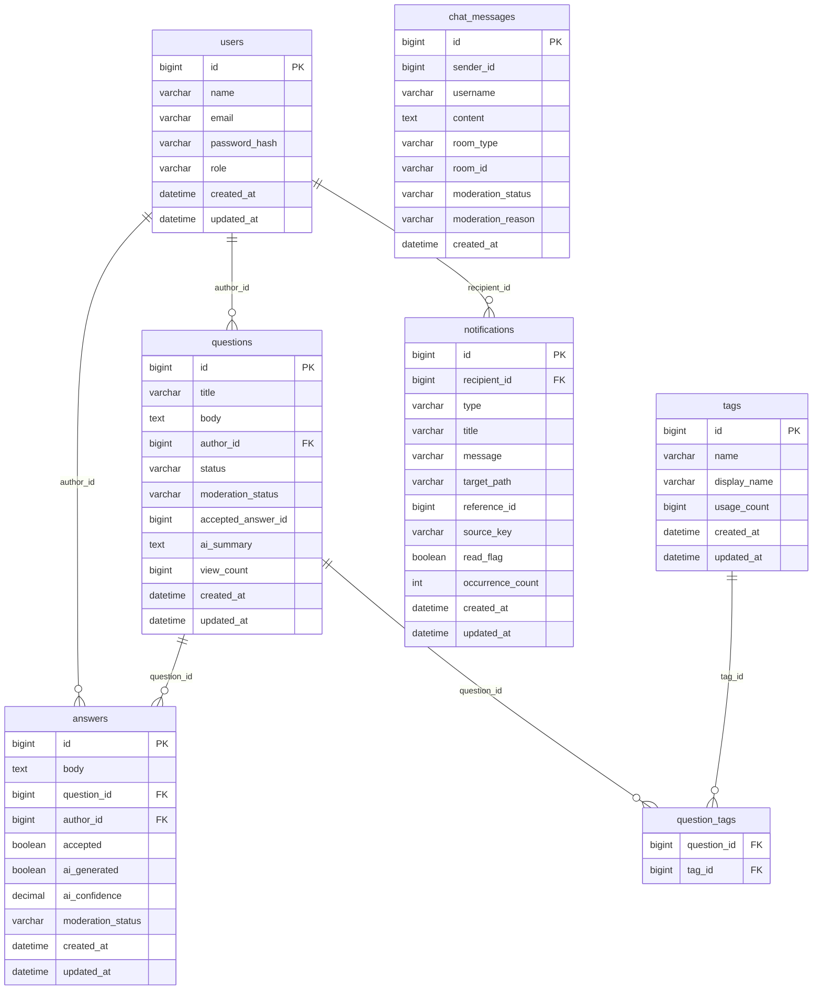

# Database Relationship Diagram

This diagram maps out the physical schema relationships, indicating foreign keys and join tables used in the underlying MySQL database.

```mermaid
erDiagram
    users {
        bigint id PK
        varchar name
        varchar email
        varchar password_hash
        varchar role
        datetime created_at
        datetime updated_at
    }

    questions {
        bigint id PK
        varchar title
        text body
        bigint author_id FK
        varchar status
        varchar moderation_status
        bigint accepted_answer_id
        text ai_summary
        bigint view_count
        datetime created_at
        datetime updated_at
    }

    answers {
        bigint id PK
        text body
        bigint question_id FK
        bigint author_id FK
        boolean accepted
        boolean ai_generated
        decimal ai_confidence
        varchar moderation_status
        datetime created_at
        datetime updated_at
    }

    tags {
        bigint id PK
        varchar name
        varchar display_name
        bigint usage_count
        datetime created_at
        datetime updated_at
    }

    question_tags {
        bigint question_id FK
        bigint tag_id FK
    }

    notifications {
        bigint id PK
        bigint recipient_id FK
        varchar type
        varchar title
        varchar message
        varchar target_path
        bigint reference_id
        varchar source_key
        boolean read_flag
        int occurrence_count
        datetime created_at
        datetime updated_at
    }

    chat_messages {
        bigint id PK
        bigint sender_id
        varchar username
        text content
        varchar room_type
        varchar room_id
        varchar moderation_status
        varchar moderation_reason
        datetime created_at
    }

    users ||--o{ questions : "author_id"
    users ||--o{ answers : "author_id"
    users ||--o{ notifications : "recipient_id"
    questions ||--o{ answers : "question_id"
    questions ||--o{ question_tags : "question_id"
    tags ||--o{ question_tags : "tag_id"
```
