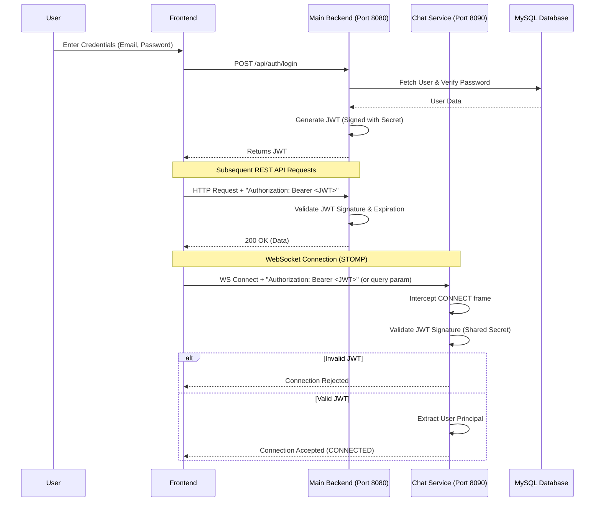

# Authentication Flow Diagram

This sequence diagram illustrates the stateless JWT-based authentication flow across the Frontend, Main Backend, and the isolated Chat Microservice.

```mermaid
sequenceDiagram
    participant User
    participant Frontend
    participant Backend as Main Backend (Port 8080)
    participant ChatService as Chat Service (Port 8090)
    participant DB as MySQL Database

    User->>Frontend: Enter Credentials (Email, Password)
    Frontend->>Backend: POST /api/auth/login
    Backend->>DB: Fetch User & Verify Password
    DB-->>Backend: User Data
    Backend->>Backend: Generate JWT (Signed with Secret)
    Backend-->>Frontend: Returns JWT

    Note over Frontend,Backend: Subsequent REST API Requests
    Frontend->>Backend: HTTP Request + "Authorization: Bearer <JWT>"
    Backend->>Backend: Validate JWT Signature & Expiration
    Backend-->>Frontend: 200 OK (Data)

    Note over Frontend,ChatService: WebSocket Connection (STOMP)
    Frontend->>ChatService: WS Connect + "Authorization: Bearer <JWT>" (or query param)
    ChatService->>ChatService: Intercept CONNECT frame
    ChatService->>ChatService: Validate JWT Signature (Shared Secret)
    alt Invalid JWT
        ChatService-->>Frontend: Connection Rejected
    else Valid JWT
        ChatService->>ChatService: Extract User Principal
        ChatService-->>Frontend: Connection Accepted (CONNECTED)
    end
```
