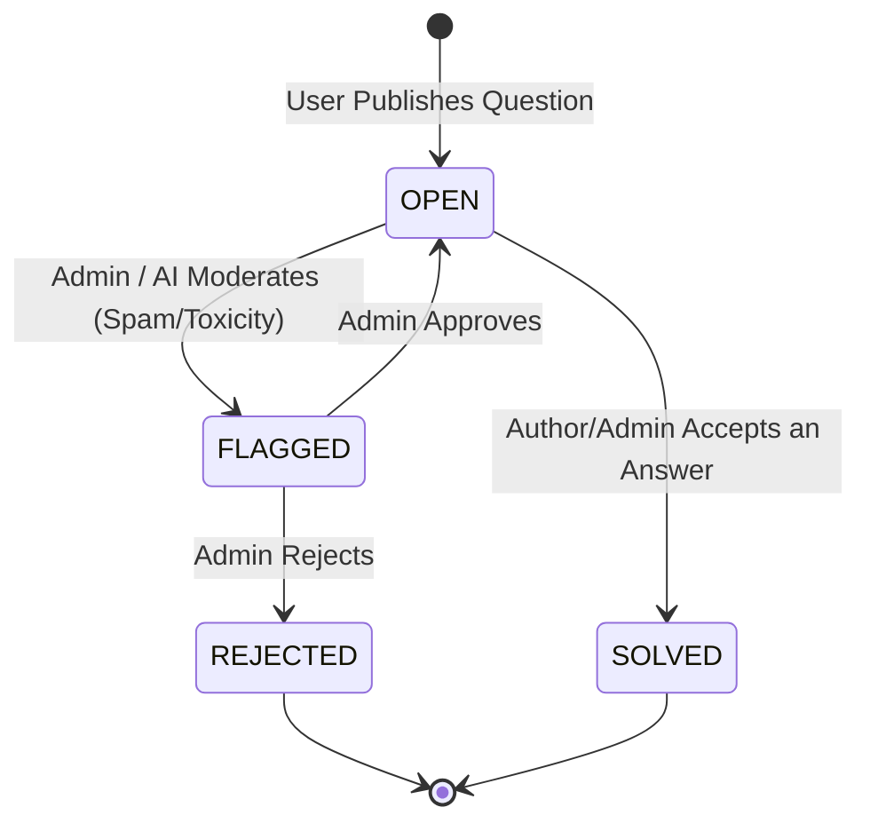

# Question Lifecycle Diagram

This state diagram maps the statuses a Question can transition through in DoConnect AI.

```mermaid
stateDiagram-v2
    [*] --> OPEN : User Publishes Question
    
    OPEN --> FLAGGED : Admin / AI Moderates (Spam/Toxicity)
    FLAGGED --> OPEN : Admin Approves
    FLAGGED --> REJECTED : Admin Rejects
    REJECTED --> [*]

    OPEN --> SOLVED : Author/Admin Accepts an Answer
    SOLVED --> [*]
```
