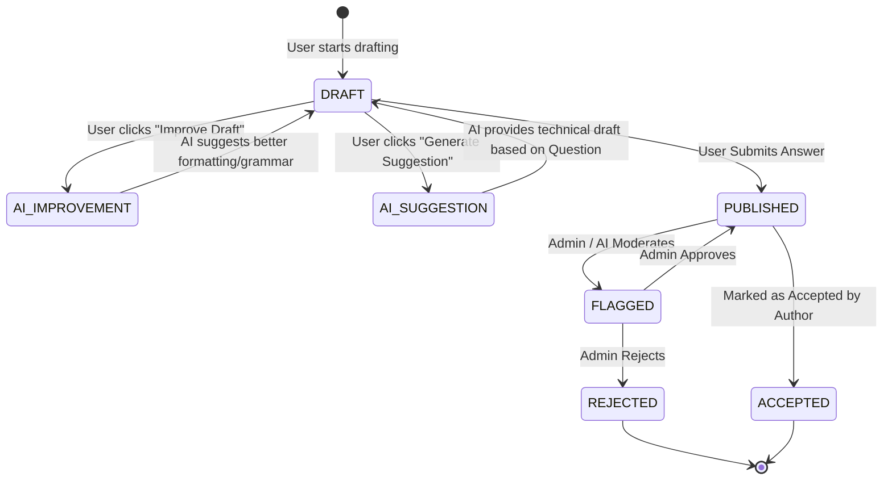

# Answer Lifecycle Diagram

This state diagram maps the flow of drafting, improving, and submitting an Answer, along with the accepted answer flow.

```mermaid
stateDiagram-v2
    [*] --> DRAFT : User starts drafting
    DRAFT --> AI_IMPROVEMENT : User clicks "Improve Draft"
    AI_IMPROVEMENT --> DRAFT : AI suggests better formatting/grammar
    
    DRAFT --> AI_SUGGESTION : User clicks "Generate Suggestion"
    AI_SUGGESTION --> DRAFT : AI provides technical draft based on Question
    
    DRAFT --> PUBLISHED : User Submits Answer

    PUBLISHED --> FLAGGED : Admin / AI Moderates
    FLAGGED --> PUBLISHED : Admin Approves
    FLAGGED --> REJECTED : Admin Rejects
    REJECTED --> [*]

    PUBLISHED --> ACCEPTED : Marked as Accepted by Author
    ACCEPTED --> [*]
```
