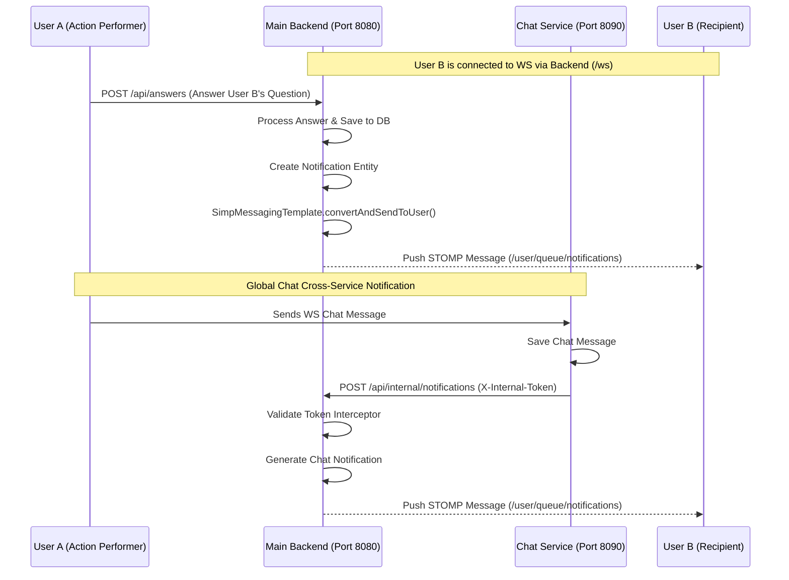

# Notification Flow Diagram

This diagram explains the architecture of the notification system, bridging the REST Main Backend and the WebSocket Notification system.

```mermaid
sequenceDiagram
    participant UserA as User A (Action Performer)
    participant Backend as Main Backend (Port 8080)
    participant ChatService as Chat Service (Port 8090)
    participant UserB as User B (Recipient)

    Note over UserB,Backend: User B is connected to WS via Backend (/ws)
    UserA->>Backend: POST /api/answers (Answer User B's Question)
    Backend->>Backend: Process Answer & Save to DB
    Backend->>Backend: Create Notification Entity
    Backend->>Backend: SimpMessagingTemplate.convertAndSendToUser()
    Backend-->>UserB: Push STOMP Message (/user/queue/notifications)
    
    Note over UserA,ChatService: Global Chat Cross-Service Notification
    UserA->>ChatService: Sends WS Chat Message
    ChatService->>ChatService: Save Chat Message
    ChatService->>Backend: POST /api/internal/notifications (X-Internal-Token)
    Backend->>Backend: Validate Token Interceptor
    Backend->>Backend: Generate Chat Notification
    Backend-->>UserB: Push STOMP Message (/user/queue/notifications)
```
