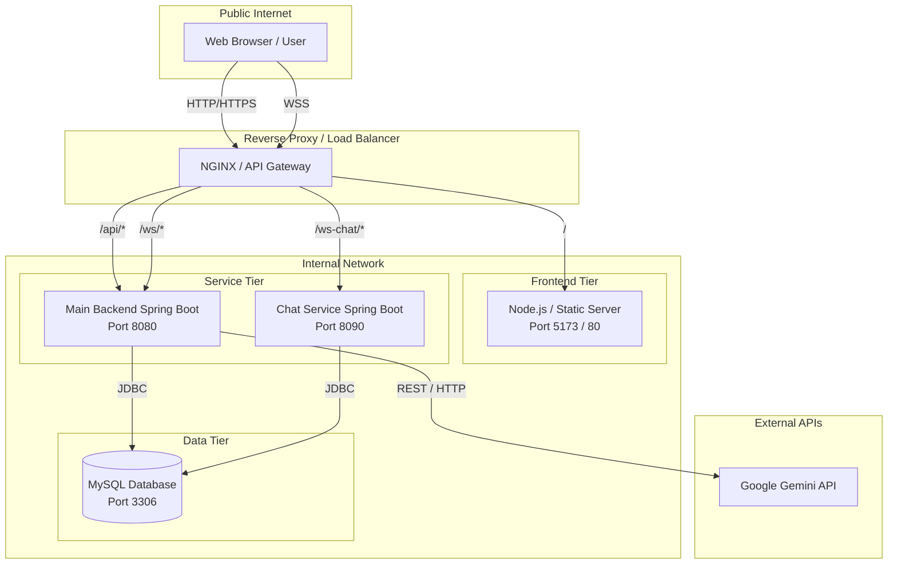

# Deployment Architecture

This diagram maps out a typical production deployment for DoConnect AI.

```mermaid
graph TD
    subgraph Public Internet
        Client[Web Browser / User]
    end

    subgraph Reverse Proxy / Load Balancer
        Nginx[NGINX / API Gateway]
    end

    subgraph Internal Network
        subgraph Frontend Tier
            ReactNode[Node.js / Static Server<br/>Port 5173 / 80]
        end

        subgraph Service Tier
            MainAPI[Main Backend Spring Boot<br/>Port 8080]
            ChatAPI[Chat Service Spring Boot<br/>Port 8090]
        end

        subgraph Data Tier
            MySQL[(MySQL Database<br/>Port 3306)]
        end
    end
    
    subgraph External APIs
        Gemini[Google Gemini API]
    end

    Client --> |HTTP/HTTPS| Nginx
    Client --> |WSS| Nginx

    Nginx --> |/| ReactNode
    Nginx --> |/api/*| MainAPI
    Nginx --> |/ws/*| MainAPI
    Nginx --> |/ws-chat/*| ChatAPI

    MainAPI --> |JDBC| MySQL
    ChatAPI --> |JDBC| MySQL

    MainAPI --> |REST / HTTP| Gemini
```
