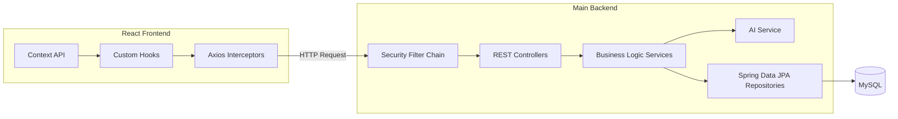

# Component Interaction Diagram

This diagram shows the internal data flow between components from the Frontend to the Database.

```mermaid
graph LR
    subgraph Frontend [React Frontend]
        Context[Context API]
        Hooks[Custom Hooks]
        Axios[Axios Interceptors]
    end

    subgraph Backend [Main Backend]
        Controller[REST Controllers]
        Security[Security Filter Chain]
        Service[Business Logic Services]
        Gemini[AI Service]
        Repository[Spring Data JPA Repositories]
    end

    Database[(MySQL)]

    Context --> Hooks
    Hooks --> Axios
    Axios --> |HTTP Request| Security
    Security --> Controller
    Controller --> Service
    Service --> Gemini
    Service --> Repository
    Repository --> Database
```
