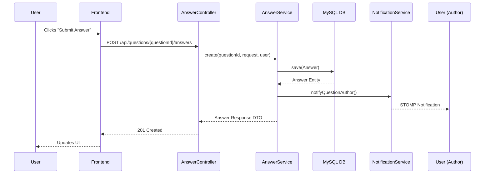

# Sequence Diagram: Post Answer

This sequence diagram illustrates the process of a user submitting an answer to a question.

```mermaid
sequenceDiagram
    participant User
    participant Frontend
    participant AnswerController
    participant AnswerService
    participant DB as MySQL DB
    participant NotificationService

    User->>Frontend: Clicks "Submit Answer"
    Frontend->>AnswerController: POST /api/questions/{questionId}/answers
    AnswerController->>AnswerService: create(questionId, request, user)
    AnswerService->>DB: save(Answer)
    DB-->>AnswerService: Answer Entity
    AnswerService->>NotificationService: notifyQuestionAuthor()
    NotificationService-->>User (Author): STOMP Notification
    AnswerService-->>AnswerController: Answer Response DTO
    AnswerController-->>Frontend: 201 Created
    Frontend-->>User: Updates UI
```
