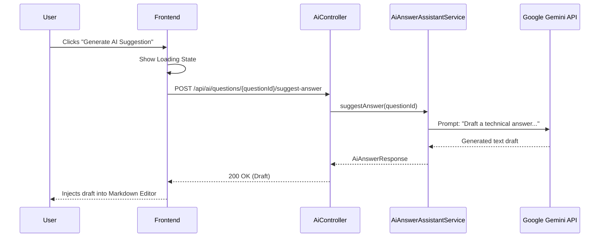

# Sequence Diagram: AI Suggestion

This sequence diagram outlines the flow when a user requests the AI to generate a suggested answer based on a question.

```mermaid
sequenceDiagram
    participant User
    participant Frontend
    participant AiController
    participant AiAnswerAssistantService
    participant GeminiAPI as Google Gemini API

    User->>Frontend: Clicks "Generate AI Suggestion"
    Frontend->>Frontend: Show Loading State
    Frontend->>AiController: POST /api/ai/questions/{questionId}/suggest-answer
    AiController->>AiAnswerAssistantService: suggestAnswer(questionId)
    AiAnswerAssistantService->>GeminiAPI: Prompt: "Draft a technical answer..."
    GeminiAPI-->>AiAnswerAssistantService: Generated text draft
    AiAnswerAssistantService-->>AiController: AiAnswerResponse
    AiController-->>Frontend: 200 OK (Draft)
    Frontend-->>User: Injects draft into Markdown Editor
```
