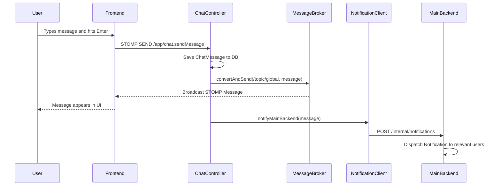

# Sequence Diagram: Global Chat

This sequence diagram demonstrates the WebSocket message flow when a user sends a chat message.

```mermaid
sequenceDiagram
    participant User
    participant Frontend
    participant ChatController
    participant MessageBroker
    participant NotificationClient
    participant MainBackend

    User->>Frontend: Types message and hits Enter
    Frontend->>ChatController: STOMP SEND /app/chat.sendMessage
    ChatController->>ChatController: Save ChatMessage to DB
    ChatController->>MessageBroker: convertAndSend(/topic/global, message)
    MessageBroker-->>Frontend: Broadcast STOMP Message
    Frontend-->>User: Message appears in UI
    
    %% Internal Cross Service Notification
    ChatController->>NotificationClient: notifyMainBackend(message)
    NotificationClient->>MainBackend: POST /internal/notifications
    MainBackend->>MainBackend: Dispatch Notification to relevant users
```
