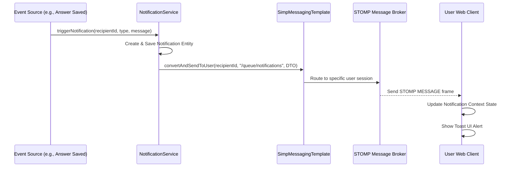

# Sequence Diagram: Notification Delivery

This sequence diagram illustrates the detailed delivery process of an in-app notification over WebSockets.

```mermaid
sequenceDiagram
    participant EventSource as Event Source (e.g., Answer Saved)
    participant NotificationService
    participant SimpMessagingTemplate
    participant STOMPBroker as STOMP Message Broker
    participant UserClient as User Web Client

    EventSource->>NotificationService: triggerNotification(recipientId, type, message)
    NotificationService->>NotificationService: Create & Save Notification Entity
    NotificationService->>SimpMessagingTemplate: convertAndSendToUser(recipientId, "/queue/notifications", DTO)
    SimpMessagingTemplate->>STOMPBroker: Route to specific user session
    STOMPBroker-->>UserClient: Send STOMP MESSAGE frame
    UserClient->>UserClient: Update Notification Context State
    UserClient->>UserClient: Show Toast UI Alert
```
