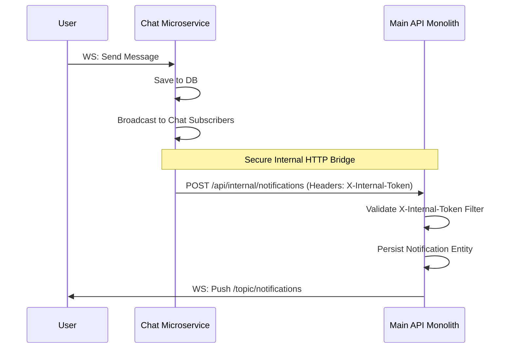

# 02 - System Architecture

## 1. System Topology

The DoConnect AI platform is architected as a decoupled, multi-service environment. It splits responsibilities across a Single Page Application (SPA) frontend, a core monolithic backend handling synchronous business logic, a dedicated microservice for asynchronous real-time chat, and a shared database layer.

### 1.1 High-Level Component Diagram

```mermaid
flowchart TD
    User([User / Browser])
    
    subgraph Frontend [React SPA Frontend :5173]
        UI[React Components]
        Context[State Contexts]
        Axios[HTTP Client]
        Stomp[STOMP WS Client]
    end

    subgraph Service Tier [Backend Services]
        subgraph MainAPI [Main API Monolith :8080]
            Auth[Auth / JWT]
            QA[Questions & Answers]
            AI_Wrapper[AI Integration]
            Notif_WS[Notification WS Hub]
            Admin[Admin & Moderation]
        end

        subgraph ChatAPI [Chat Microservice :8090]
            Chat_WS[Global Chat STOMP]
            Internal_Rest[Internal REST Client]
        end
    end

    subgraph Data & Third-Party
        DB_Main[(MySQL: doconnect_ai)]
        DB_Chat[(MySQL: doconnect_chat)]
        Gemini[Google Gemini API]
    end

    %% Client Interactions
    User -->|Interacts| UI
    UI --> Context
    Context --> Axios
    Context --> Stomp
    
    %% Network Boundaries
    Axios -->|REST HTTP| MainAPI
    Stomp -->|WS: /topic/notifications| Notif_WS
    Stomp -->|WS: /topic/global| Chat_WS
    
    %% Internal Connections
    MainAPI -->|JDBC| DB_Main
    ChatAPI -->|JDBC| DB_Chat
    
    MainAPI -->|REST| Gemini
    
    %% Service-to-Service Bridge
    Internal_Rest -.->|POST /api/internal/notifications<br/>(X-Internal-Token)| MainAPI
```

## 2. Service Boundaries

### 2.1 The React SPA (Frontend)
- **Role:** Handles all presentation logic, user session state, and client-side routing.
- **Responsibility:** Validates user inputs, manages local caches of paginated data, and maintains active WebSocket connections for both Chat and Notifications.

### 2.2 The Main API (Backend Core)
- **Role:** The primary transactional engine of the platform.
- **Responsibility:**
  - Manages JWT issuance and verification.
  - Handles CRUD operations for Questions, Answers, Tags, and Users.
  - Wraps the Google Gemini API to construct dynamic prompts and parse AI responses.
  - Maintains the `/topic/notifications` WebSocket endpoint for pushing personalized alerts to users.
- **Why Monolithic for Core?** Grouping Q&A, Tags, and Users into a single monolith avoids distributed transaction complexities and simplifies foreign-key relationships in the database.

### 2.3 The Chat Microservice
- **Role:** A highly concurrent, stateful messaging broker.
- **Responsibility:**
  - Terminates WebSocket connections for the global `/topic/chat`.
  - Persists chat histories without burdening the core application.
- **Why a Separate Service?** WebSockets hold TCP connections open indefinitely. In a high-traffic environment, thousands of idle or highly active chat connections can consume connection pool threads, starving the Main API from processing critical REST requests (like saving an answer or querying the AI). Isolating this protects the core business domain.

### 2.4 The Data Layer (MySQL)
- **Role:** Persistent storage.
- **Design:** The system utilizes two distinct schemas on the same MySQL instance:
  - `doconnect_ai`: Stores relational entities like Users, Questions, Answers, and Tags.
  - `doconnect_chat`: Stores ChatMessages.
- **Why Split Schemas?** This lays the groundwork for future physical separation of the databases. Chat databases typically experience a high volume of inserts and require different indexing strategies compared to the highly-relational read-heavy Q&A data.

## 3. Inter-Service Communication Flow

One of the primary challenges in this decoupled architecture is sharing state. Specifically, when a user sends a message in the Chat Service, how does the system notify a user who is browsing the Main API that they have an unread message?

### 3.1 The Internal Notification Bridge

We bridge the gap using a secured, synchronous REST call from the Chat Service to the Main API.



**Security Consideration:** The `/api/internal/notifications` endpoint on the Main API is explicitly blocked from public access. The `NotificationWebSocketAuthChannelInterceptor` and specific Spring Security ant-matchers ensure that only requests presenting the cryptographically secure `X-Internal-Token` (shared in `.env` files) can trigger this workflow.

## 4. Failure Scenarios & Resilience

1. **Gemini API Outage:**
   - *Impact:* Auto-tagging, duplicate detection, and AI moderation fail.
   - *Fallback:* The backend `AiService` catches connection timeouts and returns predefined fallback messages (e.g., "AI currently unavailable"). The application gracefully degrades, allowing users to manually tag and post questions, while moderation bypasses AI scoring and places everything in a "Pending Human Review" queue.
2. **Chat Service Crash:**
   - *Impact:* Users cannot send or view global chat messages.
   - *Fallback:* The React frontend `useChat` hook detects connection drops and implements exponential backoff reconnection. The core Q&A functionality (Main API) remains completely unaffected due to service isolation.
3. **Internal Bridge Failure:**
   - *Impact:* The Chat Service cannot reach the Main API to trigger notifications.
   - *Fallback:* The Chat Service logs the error but does *not* roll back the chat message transmission. Eventual consistency is maintained because the Main API calculates unread notifications dynamically upon next login, though real-time push is temporarily lost.

## 5. Design Tradeoffs

- **MySQL over NoSQL for Chat:** While MongoDB or Cassandra might be better suited for massive, unbounded chat logs, MySQL was chosen for simplicity in the current deployment scope. Splitting the schema provides an easy migration path to NoSQL later.
- **STOMP over Raw WebSockets:** STOMP adds header overhead to every message but provides essential pub/sub semantics (`/topic/`, `/queue/`) out-of-the-box, saving significant development time compared to implementing a custom routing protocol over raw WebSockets.
- **Synchronous AI Calls:** Currently, calls to the Gemini API (like generating an answer draft) block the HTTP thread until the AI responds. This provides a simpler frontend UX but can lead to long wait times. A future tradeoff would involve moving this to an asynchronous queue with a webhook or WebSocket callback.

---
*Next Document: [03-database-design.md](03-database-design.md)*
