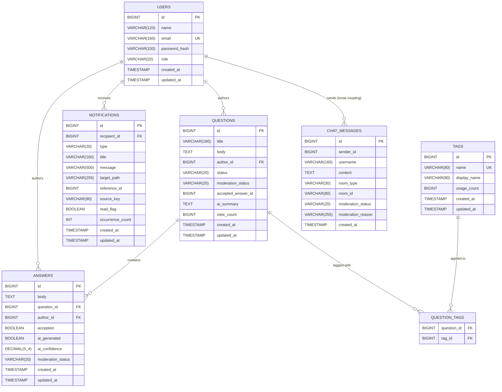

# 03 - Database Design

## 1. Relational Architecture

DoConnect AI uses a relational database model backed by MySQL 8.0. To support future physical scaling and optimize for distinct write patterns, the schema is logically separated into two databases:

1.  `doconnect_ai`: Stores all core entities (Users, Questions, Answers, Tags, Notifications). This schema is highly relational and read-heavy.
2.  `doconnect_chat`: Stores `chat_messages`. This schema is write-heavy and deliberately isolated to prevent long-running read queries on the main tables from locking chat inserts.

All entities utilize Spring Data JPA (Hibernate) for Object-Relational Mapping (ORM) and schema generation.

## 2. Entity Relationship Diagram (ERD)

## 3. Detailed Table Schemas

### 3.1. `doconnect_ai` Database

#### `users`
Core identity table.
*   **`email`**: Unique constraint. Used as the primary login identifier.
*   **`role`**: Enum (`USER`, `MODERATOR`, `ADMIN`). Enforced by Spring Security for RBAC.
*   **`password_hash`**: Stores BCrypt hashed strings.

#### `questions`
The primary content entity.
*   **`author_id`**: Foreign Key to `users`. FetchType is LAZY.
*   **`status`**: Enum (`OPEN`, `SOLVED`, `CLOSED`).
*   **`moderation_status`**: Enum (`PENDING`, `APPROVED`, `FLAGGED`, `REJECTED`). Used by the AI pipeline to quarantine content.
*   **`accepted_answer_id`**: Denormalized pointer to the `answers` table indicating the correct solution.
*   **`ai_summary`**: Stores the AI-generated condensation of the discussion thread.
*   **`view_count`**: Incremented upon detailed viewing.

#### `answers`
Responses linked to a specific question.
*   **`question_id`**: Foreign Key to `questions`. FetchType is LAZY.
*   **`author_id`**: Foreign Key to `users`. FetchType is LAZY.
*   **`accepted`**: Boolean flag marking the correct solution.
*   **`ai_generated`**: Boolean flag indicating if the answer was drafted using the Gemini assistant.
*   **`ai_confidence`**: Decimal (5,4). Optional score provided by the moderation AI.
*   **`moderation_status`**: Similar to questions, gates visibility.

#### `tags` & `question_tags`
Implements a Many-to-Many relationship.
*   **`tags.name`**: Unique constraint. Normalized identifier (e.g., `spring-boot`).
*   **`tags.usage_count`**: Denormalized counter for quick sorting/trending tag display without running `GROUP BY` counts across the join table.

#### `notifications`
Powers the real-time notification queue and history.
*   **`recipient_id`**: Foreign Key to `users`.
*   **`target_path`**: URL fragment the frontend should navigate to when clicked (e.g., `/questions/123`).
*   **`source_key`**: A unique string used to group repetitive notifications (e.g., "new_answer_Q123").
*   **`occurrence_count`**: Combined with `source_key`, this rolls up spamming events ("You have 5 new answers on Question X") instead of creating 5 distinct DB rows.

### 3.2. `doconnect_chat` Database

#### `chat_messages`
Append-only table for real-time messaging.
*   **`sender_id` & `username`**: `sender_id` maps to the user ID in the main database, but there is no strict Foreign Key constraint because the databases are separate. `username` is denormalized to avoid requiring the chat service to query the main API for display names.
*   **`room_type` & `room_id`**: Enums/Strings (`GLOBAL`, etc.) allowing for future horizontal partitioning or multi-room support.
*   **`moderation_status`**: Yes, chat messages are also piped through AI moderation logic.

## 4. Lifecycle Hooks (JPA)
All tables feature `created_at` and (except chat) `updated_at` timestamps. These are automatically managed at the application layer via JPA `@PrePersist` and `@PreUpdate` annotations rather than MySQL triggers.

## 5. Failure Scenarios & Tradeoffs

*   **Tradeoff: Denormalized `username` in `chat_messages`**
    *   *Why:* To display messages quickly, the chat service needs the user's name. Fetching this across databases per message is slow.
    *   *Failure Scenario:* If a user changes their name in the main database, historical chat messages will retain the old name. This is acceptable for chat logs but must be documented.
*   **Tradeoff: Denormalized `usage_count` in `tags`**
    *   *Why:* Tag feeds require instant sorting by popularity.
    *   *Failure Scenario:* If a question is deleted, the tag logic must decrement the counter manually via application code, risking drift. A scheduled job could recalculate this periodically to ensure absolute consistency.

---
*Next Document: [04-authentication-security.md](04-authentication-security.md)*
